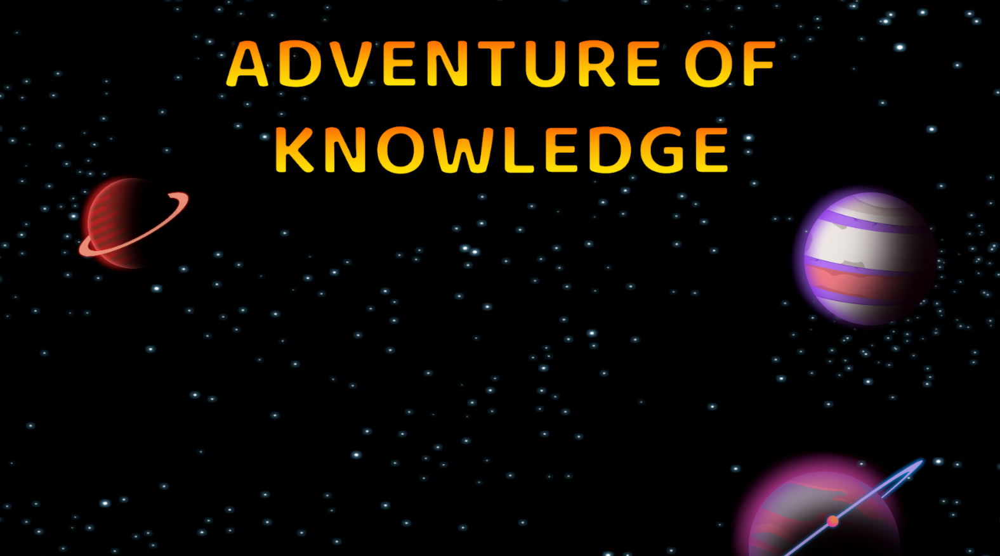
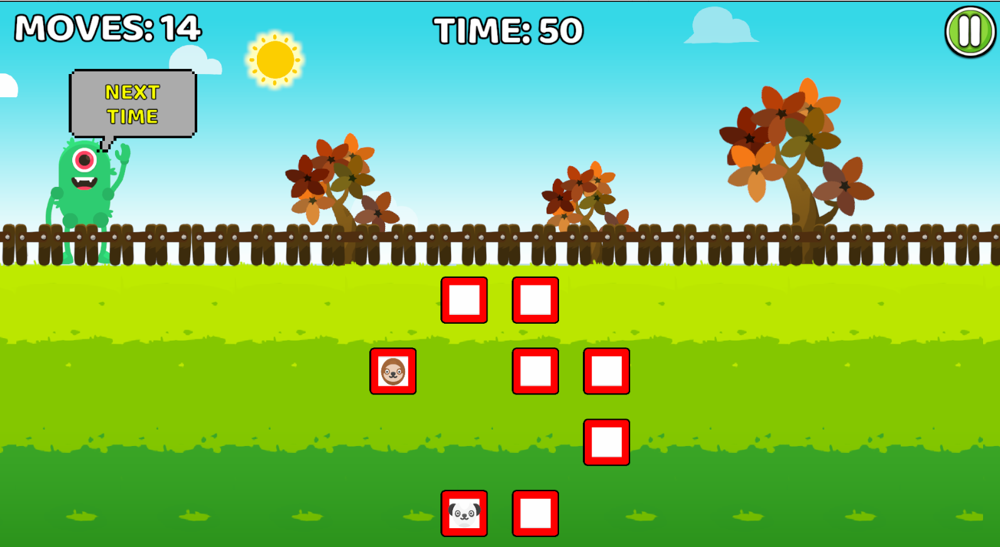
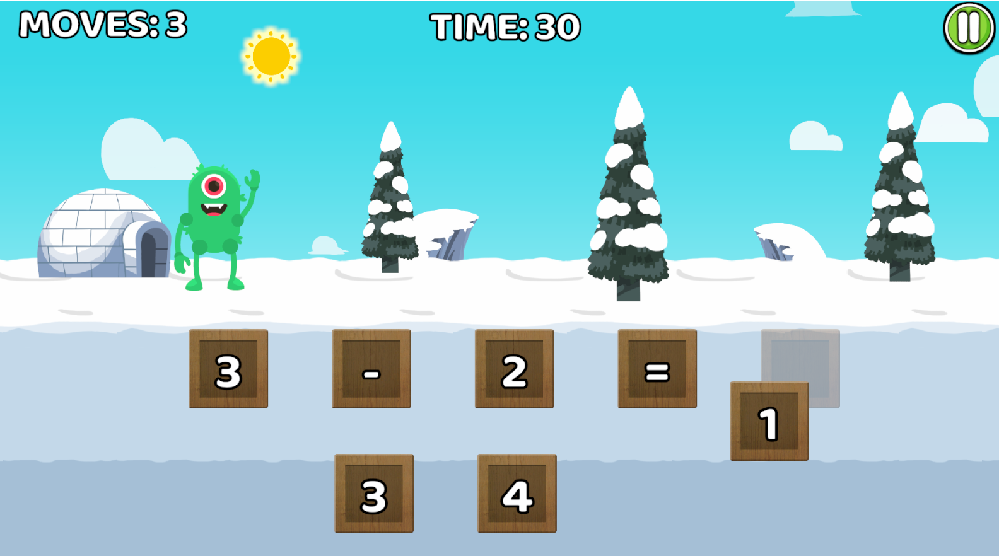
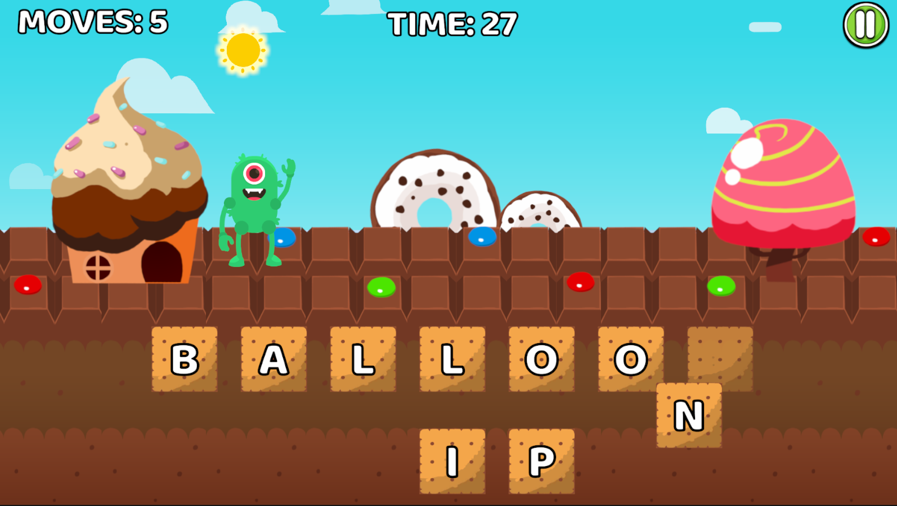
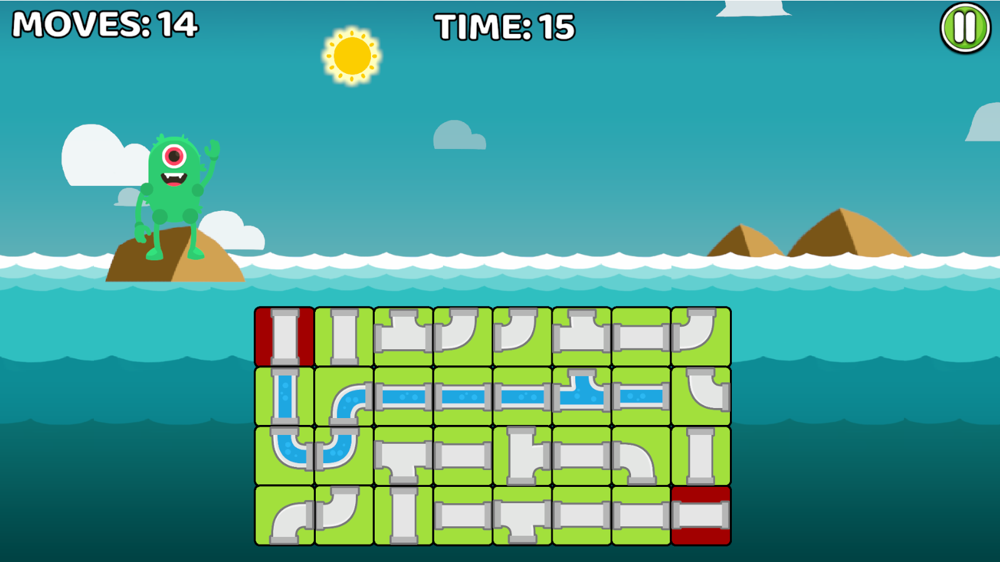
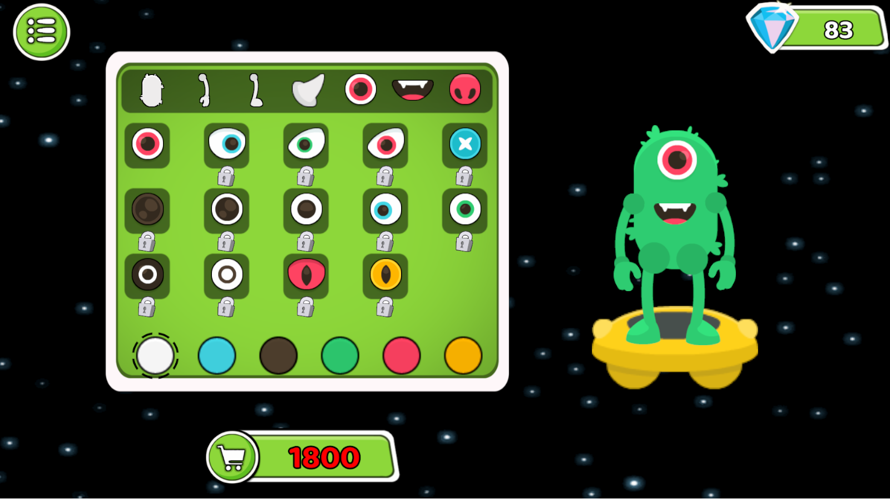
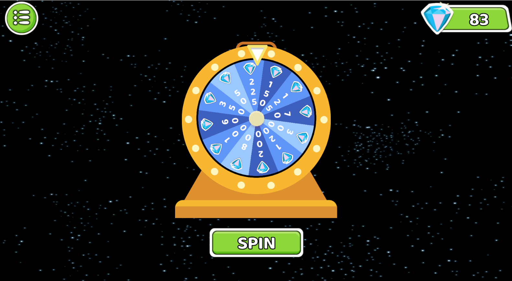

The Adventure of Knowledge is an interactive and engaging educational game that provides an entertaining journey through a variety of areas of learning, including memory, language, and mathematics.

<b>Itch:<b> https://libertox.itch.io/ad  

# Game Mode

## Memory Game

The player's task is to match identical tiles by rotating. The goal is to arrange all tiles in the correct layout.

## Math Game
In this mode, the player must solve various mathematical operations such as addition, subtraction, multiplication, or division. The aim is to correctly calculate the result of each operation

## Letter Game

Players are presented with words with missing letters, and their task is to choose the correct letter to fill in the gap and complete the word.

## Labyrinth Game

In this game, the player must logically connect different pipes to create a continuous path for flowing water. The goal is to connect all pipes so that water can flow freely through the entire system

# Additional Features

## Monster Creator

Players have the option to create their own unique monster character. They can customize various aspects of the monster's appearance, such as its body shape, color, size, and special features. The goal is to design a monster that reflects the player's creativity and imagination.

## Fortune Wheel

Players have the opportunity to spin a wheel of rewards. By spinning the wheel, players can earn various prizes.

